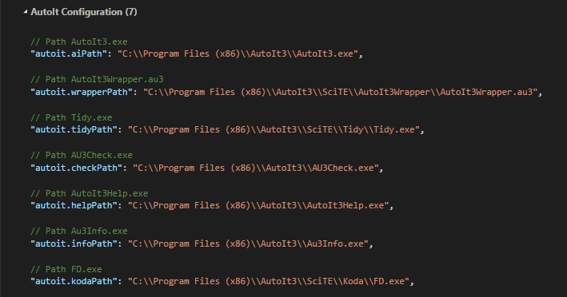

# AutoIt for Visual Studio Code

Welcome to the AutoIt extension for Visual Studio Code! This has been forked
and developed from Damien122's release.

[Features](#features) | [Configuration](#configuration) | [Keyboard Shortcuts](#keyboard-shortcuts) | [Contributing](#contributing)

## Features

* AutoIt Syntax highlighting
* IntelliSense (code hints and completion)

  

* Launch, compile and build scripts from VSCode
* Launch AutoIt Help for highlighted text
* Symbol search, press `Ctrl+Shift+O` to see where Functions and Variables have been declared in the current script

  

## Configuration
By default, this extension is set up for the default installation of AutoIt and SciTe4AutoIt on a 64-bit system. For alternate setups, you can access the user settings by navigating to `File-> Preferences-> Settings` or invoking the command palette (`Ctrl+Shift+P`) and searching for Preferences [(example)](img/docs/CtrlShiftP.png), and changing the following options:

| Config                             | Description                                                                                            | Default                                                                       |
| ---------------------------------- | ------------------------------------------------------------------------------------------------------ | ----------------------------------------------------------------------------- |
| `autoit.aiPath`                    | Path to AutoIt Executable                                                                              | "C:\\Program Files (x86)\\AutoIt3\\AutoIt3.exe"                               |
| `autoit.wrapperPath`               | Path to AutoIt3Wrapper                                                                                 | "C:\\Program Files (x86)\\AutoIt3\\SciTE\\AutoIt3Wrapper\\AutoIt3Wrapper.au3" |
| `autoit.tidyPath`                  | Path to Tidy                                                                                           | "C:\\Program Files (x86)\\AutoIt3\\SciTE\\Tidy\\Tidy.exe"                     |
| `autoit.checkPath`                 | Path to AutoIt Syntax Checker (Au3Check)                                                               | "C:\\Program Files (x86)\\AutoIt3\\AU3Check.exe"                              |
| `autoit.helpPath`                  | Path to AutoIt Help                                                                                    | "C:\\Program Files (x86)\\AutoIt3\\AutoIt3Help.exe"                           |
| `autoit.infoPath`                  | Path to Au3Info Executable                                                                             | "C:\\Program Files (x86)\\AutoIt3\\Au3Info.exe"                               |
| `autoit.kodaPath`                  | Path to Koda Form Designer                                                                             | "C:\\Program Files (x86)\\AutoIt3\\SciTE\\Koda\\FD.exe"                       |
| `autoit.showVariablesInGoToSymbol` | Determines whether to show or hide variables when using Ctrl+Shift+O (added in v0.1.9)                 | true                                                                          |
| `autoit.includePaths`              | Paths to look for include files from, in an array. (added in v0.1.9)                                   | ["C:\\Program Files (x86)\\AutoIt3\\Include"]                                 |
| `autoit.consoleParams`             | A string of parameters passed to the console when the Run Script command is launched (added in v0.2.1) | ""                                                                            |

<!-- * Access the command palette `Ctrl+Shift+P`, type Preferences: Open User Settings or Preferences: Open Workspace Settings. -->

  <!--  -->

<!-- * Configure the paths according to your AutoIt installation. -->

  <!--  -->

## Keyboard Shortcuts
* Run Script: `F5`
* AutoIt Check: `Ctrl+F5`
* Compile Script: `Ctrl+F7`
* Build Script: `F7`
* Run AutoIt Help: `Ctrl+F1`
* Run Au3Info: `Ctrl+F6`
* Debug to MsgBox: `Ctrl+Shift+D`
* Debug to Console: `Alt+D`
* Run Koda: `Alt+M`
* Set Command Line Parameters: `Shift+F8`
* Kill Running Script: `Ctrl+Pause/Break`
* Go To Definition (Jump to Variable or Function declaration): `F12`
* Peek Definition (Show declarations in pop up): `Alt+F12`
> **NOTE:**
>
> Run, Compile and Build Script functions require the full install of [SciTE4AutoIt3](https://www.autoitscript.com/site/autoit-script-editor/downloads/) alongside AutoIt.

## Contributing
Check out the code, leave feedback and feature requests now on [GitHub/loganch](https://github.com/loganch/AutoIt-VSCode)

Please fork the repository and contribute using pull requests.

---

[Features](#features) | [Configuration](#configuration) | [Keyboard Shortcuts](#keyboard-shortcuts) | [Contributing](#contributing)
